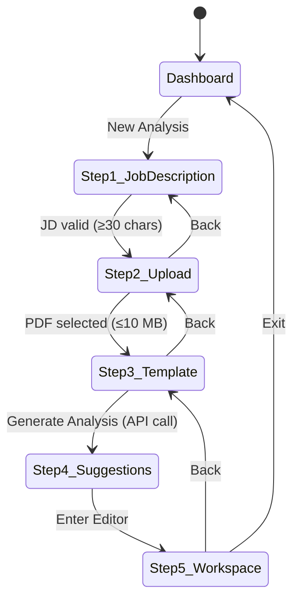

# Design Document: Resume Editor Flow

## Overview

This document describes the technical design for redesigning the resume builder's onboarding wizard and editor workspace into a unified five-step flow. The new flow replaces the existing three-step wizard (target role → document upload → template selection) and the separate `AnalysisWorkspace` with a cohesive, sequential experience:

1. **Paste job description** — the user's intent anchors the entire session
2. **Upload PDF resume** — the source document for parsing and analysis
3. **Pick a template** — the visual layout for the final output
4. **AI suggestions panel** — improvement recommendations from the analysis engine
5. **Live resume preview with left-side editor** — real-time editing against the selected template

The redesign is primarily a **front-end orchestration change**. The backend API (`POST /api/analysis/upload`, `GET /api/analysis/:id`, `PATCH /api/analysis/:id`) remains unchanged. The main work is restructuring the wizard step sequence, splitting the combined upload+JD step into two dedicated steps, and integrating the suggestions panel as a distinct step before the full workspace.

---

## Architecture

The application follows a **feature-slice architecture** inside `apps/web/features/`. Each feature owns its views, components, view-models, and models. The flow is orchestrated by a single top-level wizard component (`DeepFocusWizard`) that manages all shared state and transitions between steps and the workspace view.

```
apps/web/
  app/
    page.tsx                          ← entry point, mounts DeepFocusWizard or DashboardView
  features/
    onboarding/
      views/
        deep-focus-wizard.tsx         ← MODIFIED: orchestrator, now 4 wizard steps
      components/
        step-job-description.tsx      ← NEW: step 1 (extracted from StepDocumentUpload)
        step-document-upload.tsx      ← MODIFIED: step 2, PDF-only, no JD textarea
        step-template-selection.tsx   ← unchanged (step 3)
        step-suggestions.tsx          ← NEW: step 4, suggestions panel before workspace
        wizard-icons.tsx              ← unchanged
      utils/
        analysis-api.ts               ← unchanged
        wizard-utils.ts               ← unchanged
    editor/
      views/
        analysis-workspace.tsx        ← MODIFIED: step 5, left editor + center preview
      components/
        resume-renderer.tsx           ← unchanged
        editors/                      ← unchanged
      model/
        resume-form.ts                ← unchanged
        resume-analysis.ts            ← unchanged
        resume-extraction.ts          ← unchanged
      view-models/
        use-resume-editor.ts          ← unchanged
    templates/                        ← unchanged
```

### State Flow



All wizard state lives in `DeepFocusWizard`. No state is stored in child step components — they receive values and callbacks as props.

---

## Components and Interfaces

### `DeepFocusWizard` (modified)

The top-level orchestrator. Manages the step counter (`1 | 2 | 3 | 4`), the workspace view mode, and all shared state.

**State additions vs. current implementation:**

| State field | Type | Purpose |
|---|---|---|
| `step` | `1 \| 2 \| 3 \| 4` | Current wizard step (was `1 \| 2 \| 3`) |
| `jobDescription` | `string` | Moved from step 2 to step 1 |
| `analysisResult` | `ResumeAnalysisResult \| null` | Populated after step 3 API call |

The `jobDescription` field already exists in the current wizard but is collected on step 2. In the new flow it is collected on step 1, so the field moves to step 1's component.

**Step transition logic:**

```
step 1 → step 2: jobDescription.trim().length >= 30
step 2 → step 3: resumeFile !== null (PDF, ≤10 MB)
step 3 → step 4: analysis API call succeeds (isGeneratingAnalysis guard)
step 4 → workspace: user clicks "Enter Editor"
workspace → step 3: back button
```

**Back navigation restores state:** All state fields (`jobDescription`, `resumeFile`, `selectedTemplateId`, `analysisResult`) are held in the wizard and survive back navigation without re-fetching.

---

### `StepJobDescription` (new component)

**File:** `apps/web/features/onboarding/components/step-job-description.tsx`

Extracted from the current `StepDocumentUpload`. Displays the job description textarea as the sole focus of step 1.

```typescript
interface StepJobDescriptionProps {
  jobDescription: string;
  setJobDescription: (value: string) => void;
  onNext: () => void;
  canContinue: boolean;
}
```

**Behaviour:**
- Textarea accepts plain text; no file input
- Live character count displayed below the textarea (`trimmedLength` characters)
- Inline validation error shown when `trimmedLength > 0 && trimmedLength < 30`
- Continue button disabled when `trimmedLength < 30`
- Step indicator: `STEP 1 OF 4`

---

### `StepDocumentUpload` (modified)

**File:** `apps/web/features/onboarding/components/step-document-upload.tsx`

Simplified to only handle PDF upload. The job description textarea is removed.

```typescript
interface StepDocumentUploadProps {
  resumeInputId: string;
  resumeInputRef: React.RefObject<HTMLInputElement | null>;
  isDragActive: boolean;
  setIsDragActive: (active: boolean) => void;
  handleDrop: (event: React.DragEvent<HTMLLabelElement>) => void;
  handleFileChange: (event: React.ChangeEvent<HTMLInputElement>) => void;
  resumeFile: File | null;
  formatFileSize: (size: number) => string;
  openFilePicker: () => void;
  uploadError: string;
  onNext: () => void;
  canContinue: boolean;
}
```

**Behaviour:**
- Accepts `.pdf` only (`accept=".pdf"`) — the `isSupportedFile` utility is updated to PDF-only for this step
- Max 10 MB enforced via `maxFileSize` constant (unchanged)
- Drag-and-drop and file browser both supported
- On valid file: shows file name + formatted size
- Step indicator: `STEP 2 OF 4`

---

### `StepTemplateSelection` (unchanged interface, step label updated)

Step indicator updated from `STEP 3 OF 3` to `STEP 3 OF 4`. The "Generate Analysis" button triggers the API call and transitions to step 4 on success.

---

### `StepSuggestions` (new component)

**File:** `apps/web/features/onboarding/components/step-suggestions.tsx`

Displays the AI analysis results as a dedicated step before the full workspace. The user reviews suggestions and then clicks "Enter Editor" to proceed to the workspace.

```typescript
interface StepSuggestionsProps {
  analysisResult: ResumeAnalysisResult;
  onEnterEditor: () => void;
  onBack: () => void;
}
```

**Layout:**
- Step indicator: `STEP 4 OF 4`
- Summary bar: total suggestions count, critical count, matched keyword count, missing keyword count
- Scrollable list of suggestion cards (title, detail, severity badge)
- "Enter Editor" CTA button → transitions to workspace view
- Back button → returns to step 3 (template selection)

**Severity badge mapping:**

| `severity` | Badge label | Badge colour |
|---|---|---|
| `"high"` | Critical | Rose |
| `"medium"` (impact category) | Impact | Amber |
| `"low"` | Edit | Slate |

---

### `AnalysisWorkspace` (modified)

**File:** `apps/web/features/editor/views/analysis-workspace.tsx`

The workspace is now step 5 (the editor view). The suggestions panel that currently lives inside the workspace's right column is removed — suggestions are shown in `StepSuggestions` before the user enters the workspace. The workspace focuses on the left editor + center preview layout.

**Props interface** (simplified — `analysisResult` is still passed for the "Tailor to Job" re-analysis feature):

```typescript
interface AnalysisWorkspaceProps {
  targetRole: string;
  selectedTemplateId: ResumeTemplateVariant;
  resumeFileName: string;
  resumeSourceUrl?: string | null;
  resumePreviewUrl?: string | null;
  analysisResult: ResumeAnalysisResult | null;
  initialForm?: ResumeForm;
  onBack: () => void;
  onTemplateChange?: (id: ResumeTemplateVariant) => void;
  onAnalysisUpdate?: (result: ResumeAnalysisResult) => void;
  onJobDescriptionChange?: (jd: string) => void;
}
```

**Layout (step 5):**

```
┌─────────────────────────────────────────────────────────────┐
│  Header: Back | Resume title | Saved | Tailor to Job | Download │
├──────────────────────┬──────────────────────────────────────┤
│  Left: Editor Panel  │  Center: Resume Preview              │
│  (420px fixed)       │  (flex-1, zoom controls)             │
│                      │                                      │
│  Section list or     │  Structured template / uploaded PDF  │
│  inline section form │  / parsed text fallback              │
└──────────────────────┴──────────────────────────────────────┘
```

The right-side suggestions column (`xl:grid-cols-[minmax(0,1fr)_22rem]`) is removed. The preview takes the full remaining width.

---

## Data Models

No new data models are introduced. The existing models are reused as-is.

### `ResumeAnalysisResult`

```typescript
interface ResumeAnalysisResult {
  id?: string;
  targetRole: string;
  jobDescription?: string;
  selectedTemplateId?: string;
  parsedResumeText?: string;
  score: number;
  metricsFound: number;
  matchedKeywords: string[];
  missingKeywords: string[];
  suggestions: AnalysisSuggestion[];
  generatedAt: string;
  sourceFileName?: string;
  sourceFileContentType?: string;
  extractedCharacterCount?: number;
  extractedProfile?: ExtractedResumeProfile | null;
  extractionProvider?: "parser" | "openai";
}
```

### `ResumeForm`

```typescript
interface ResumeForm {
  personalInfo: PersonalInfo;
  education: EducationEntry[];
  experience: ExperienceEntry[];
  leadership: LeadershipEntry[];
  awards: string[];
  projects: ProjectEntry[];
}
```

### Wizard Step State (in `DeepFocusWizard`)

```typescript
type WizardStep = 1 | 2 | 3 | 4;
type ViewMode = "wizard" | "workspace";

// All fields held in DeepFocusWizard component state:
step: WizardStep
viewMode: ViewMode
jobDescription: string          // collected at step 1
resumeFile: File | null         // collected at step 2
selectedTemplateId: ResumeTemplateVariant  // collected at step 3
analysisResult: ResumeAnalysisResult | null  // populated after step 3 API call
```

### Validation Rules

| Step | Field | Rule |
|---|---|---|
| 1 | `jobDescription` | `trim().length >= 30` |
| 2 | `resumeFile` | not null, type `application/pdf`, size `<= 10 MB` |
| 3 | `selectedTemplateId` | any valid `ResumeTemplateVariant`; defaults to `"minimalist-grid"` |

---

## Correctness Properties

*A property is a characteristic or behavior that should hold true across all valid executions of a system — essentially, a formal statement about what the system should do. Properties serve as the bridge between human-readable specifications and machine-verifiable correctness guarantees.*

### Property 1: Job description validation gate

*For any* string input to the job description field, the continue button should be enabled if and only if the trimmed length of that string is greater than or equal to 30.

**Validates: Requirements 1.2, 6.5**

---

### Property 2: Live character count accuracy

*For any* string input to the job description field, the displayed character count should equal the trimmed length of that string.

**Validates: Requirements 1.5**

---

### Property 3: File acceptance rule

*For any* file object, the upload step should accept it (enable continue, show confirmation) if and only if the file's MIME type is `application/pdf` and its size is less than or equal to 10,485,760 bytes (10 MB). For any file that fails either condition, an appropriate error message should be displayed.

**Validates: Requirements 2.2, 2.3, 2.4, 2.7**

---

### Property 4: File confirmation display

*For any* valid PDF file, after it is selected, the upload step should display both the file's name and its formatted size.

**Validates: Requirements 2.6**

---

### Property 5: Template cards completeness

*For any* array of template definitions, the template picker should render exactly one card per template, each containing the template's name and ATS label.

**Validates: Requirements 3.2, 3.4**

---

### Property 6: Template selection persistence

*For any* template selected in the template picker, that template's ID should be the one used to render the resume preview in the workspace, and should be restored when navigating back from the workspace to the wizard.

**Validates: Requirements 3.3, 3.5, 3.6, 5.1, 6.3**

---

### Property 7: Suggestion card rendering

*For any* `AnalysisSuggestion` object, the rendered suggestion card should contain the suggestion's title, detail text, and a severity badge whose label corresponds to the severity value.

**Validates: Requirements 4.2**

---

### Property 8: Suggestion summary counts

*For any* array of `AnalysisSuggestion` objects, the summary bar should display a total count equal to the array length and a critical count equal to the number of suggestions with `severity === "high"`.

**Validates: Requirements 4.3**

---

### Property 9: Keyword counts display

*For any* `ResumeAnalysisResult`, the suggestions panel should display a matched keyword count equal to `matchedKeywords.length` and a missing keyword count equal to `missingKeywords.length`.

**Validates: Requirements 4.6**

---

### Property 10: Editor sections completeness

*For any* resume form, the editor panel should list all five standard sections: Personal Info, Education, Work Experience, Leadership, and Awards.

**Validates: Requirements 5.3**

---

### Property 11: Section editor activation

*For any* section ID in the editor panel, activating that section should render the corresponding inline form editor for that section.

**Validates: Requirements 5.4**

---

### Property 12: Form edit round-trip

*For any* field update applied to the resume form via a section editor, the resume preview should render the updated value.

**Validates: Requirements 5.5, 5.8**

---

### Property 13: Zoom bounds enforcement

*For any* sequence of zoom adjustments (increments or decrements), the resulting zoom level should always be clamped to the range [70, 160].

**Validates: Requirements 5.7**

---

### Property 14: Step indicator accuracy

*For any* wizard step value N in {1, 2, 3, 4}, the step indicator should display "STEP N OF 4".

**Validates: Requirements 6.1**

---

### Property 15: Back button presence

*For any* wizard step greater than 1, a back navigation control should be rendered.

**Validates: Requirements 6.2**

---

### Property 16: Tailor modal pre-fill

*For any* current job description string, opening the "Tailor to Job" modal should pre-fill the job description input with that exact string.

**Validates: Requirements 8.2**

---

## Error Handling

### Step 1 — Job Description Validation
- Inline error shown when `trimmedLength > 0 && trimmedLength < 30`: "Paste at least 30 characters from the job description."
- Continue button disabled; no error shown when field is empty (user hasn't started yet).

### Step 2 — File Upload Validation
- Non-PDF file selected: "Please choose a PDF resume." (error shown below drop zone)
- File exceeds 10 MB: "Your resume must be 10 MB or smaller."
- Error cleared when a valid file is selected.

### Step 3 → Step 4 — Analysis API Failure
- If `createResumeAnalysis` throws, the error message is displayed inline below the "Generate Analysis" button (existing `analysisError` state).
- The user remains on step 3 and can retry.

### Step 4 — Suggestions Display
- If `analysisResult.suggestions` is empty, the panel shows a neutral empty state: "No suggestions — your resume looks well-matched to this role."

### Workspace — Tailor to Job Re-analysis Failure
- If `updateResumeAnalysis` throws, the error is shown inside the modal (`updateError` state).
- Previous `analysisResult` is preserved; the modal stays open for retry.

### URL Restoration Failure
- If `getResumeAnalysis` fails when restoring from `?analysis=` URL param, the wizard resets to step 1 and shows the error message. The URL param is cleared.

---

## Testing Strategy

### Unit Tests (example-based)

Focus on specific scenarios and edge cases:

- `StepJobDescription`: renders step indicator "STEP 1 OF 4"; continue button disabled on empty input; error shown for 1–29 char input; continue enabled at exactly 30 chars.
- `StepDocumentUpload`: renders step indicator "STEP 2 OF 4"; drag-and-drop handlers are wired; non-PDF file shows error; oversized file shows error.
- `StepTemplateSelection`: renders step indicator "STEP 3 OF 4"; default template pre-selected when none chosen.
- `StepSuggestions`: renders step indicator "STEP 4 OF 4"; empty suggestions state; "Enter Editor" button calls `onEnterEditor`.
- `AnalysisWorkspace`: download button present in header; download button disabled with "Export PDF" label when no source URL; "Tailor to Job" button present; loading overlay shown when `isUpdatingAnalysis=true`; error shown in tailor modal on failure.
- `DeepFocusWizard`: back navigation from workspace restores step 3; URL param triggers analysis restoration.

### Property-Based Tests

Use [fast-check](https://github.com/dubzzz/fast-check) (TypeScript-native PBT library). Each test runs a minimum of 100 iterations.

**Tag format:** `Feature: resume-editor-flow, Property {N}: {property_text}`

| Property | Test description | Arbitraries |
|---|---|---|
| P1 | JD validation gate | `fc.string()` of varying length |
| P2 | Character count accuracy | `fc.string()` |
| P3 | File acceptance rule | `fc.record({ type: fc.string(), size: fc.nat() })` |
| P4 | File confirmation display | `fc.record({ name: fc.string(), size: fc.nat(10_485_760) })` |
| P5 | Template cards completeness | `fc.array(templateArbitrary)` |
| P6 | Template selection persistence | `fc.constantFrom(...sampleTemplates).map(t => t.id)` |
| P7 | Suggestion card rendering | `fc.record({ title, detail, severity, category })` |
| P8 | Suggestion summary counts | `fc.array(suggestionArbitrary)` |
| P9 | Keyword counts display | `fc.record({ matchedKeywords: fc.array(fc.string()), missingKeywords: fc.array(fc.string()) })` |
| P10 | Editor sections completeness | `fc.record(resumeFormArbitrary)` |
| P11 | Section editor activation | `fc.constantFrom("personal","education","experience","leadership","awards")` |
| P12 | Form edit round-trip | `fc.record(resumeFormArbitrary)` with random field mutation |
| P13 | Zoom bounds enforcement | `fc.array(fc.integer({ min: -30, max: 30 }))` (sequence of deltas) |
| P14 | Step indicator accuracy | `fc.constantFrom(1, 2, 3, 4)` |
| P15 | Back button presence | `fc.constantFrom(2, 3, 4)` |
| P16 | Tailor modal pre-fill | `fc.string({ minLength: 30 })` |

### Integration Tests

- `POST /api/analysis/upload` with a real PDF and job description returns a non-empty `suggestions` array.
- `PATCH /api/analysis/:id` with a new job description returns updated suggestions.
- `GET /api/analysis/:id/source` returns the original file bytes.

These run against the Express API with the in-memory repository to avoid database dependencies in CI.
